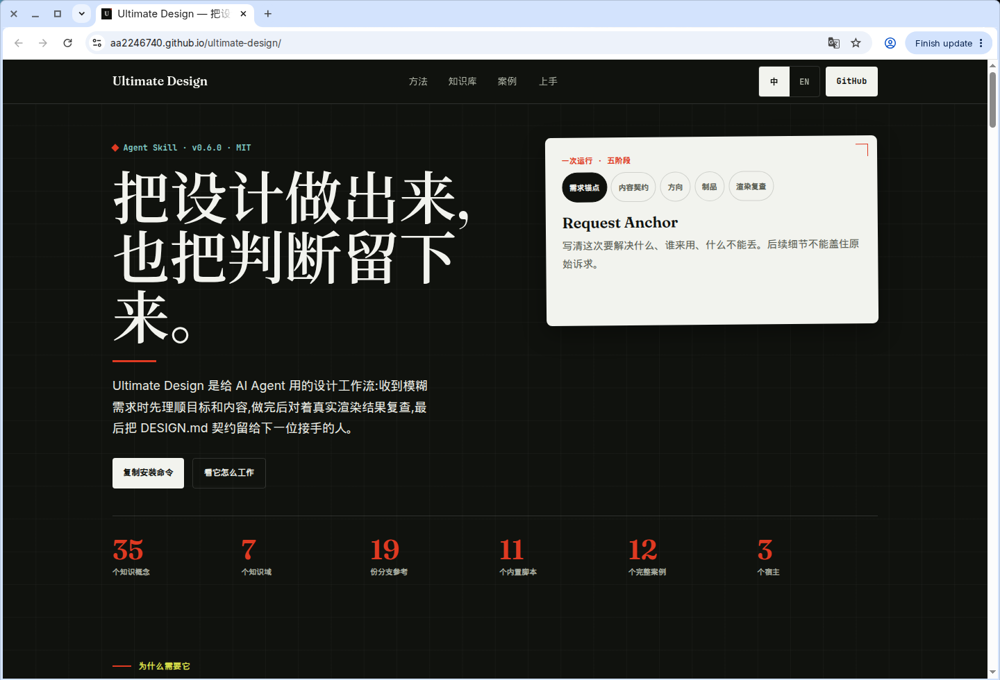
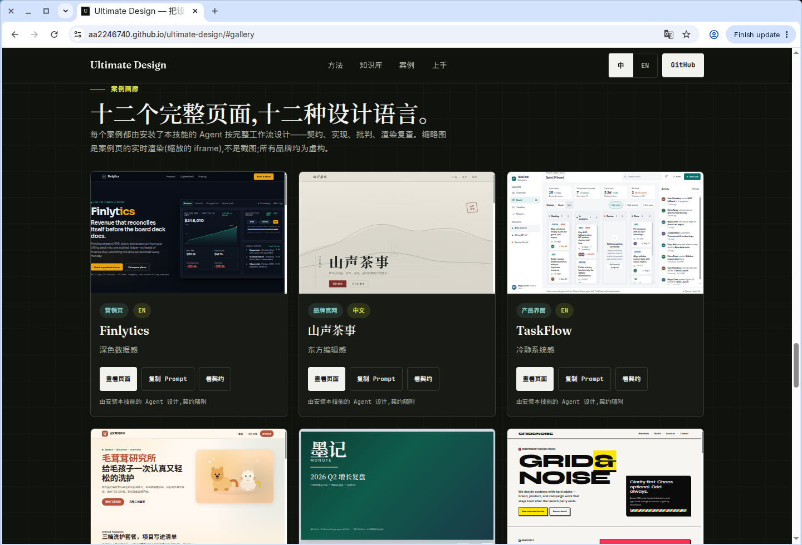
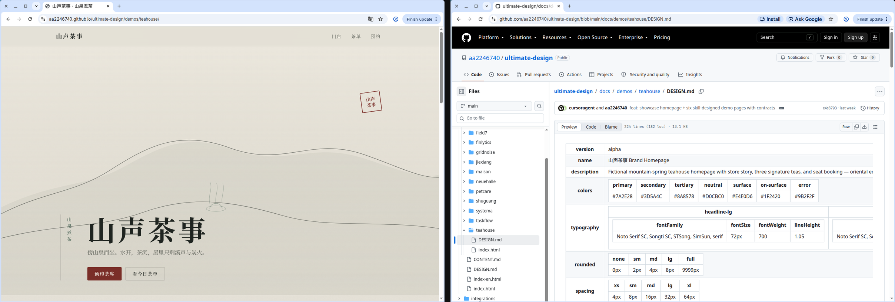
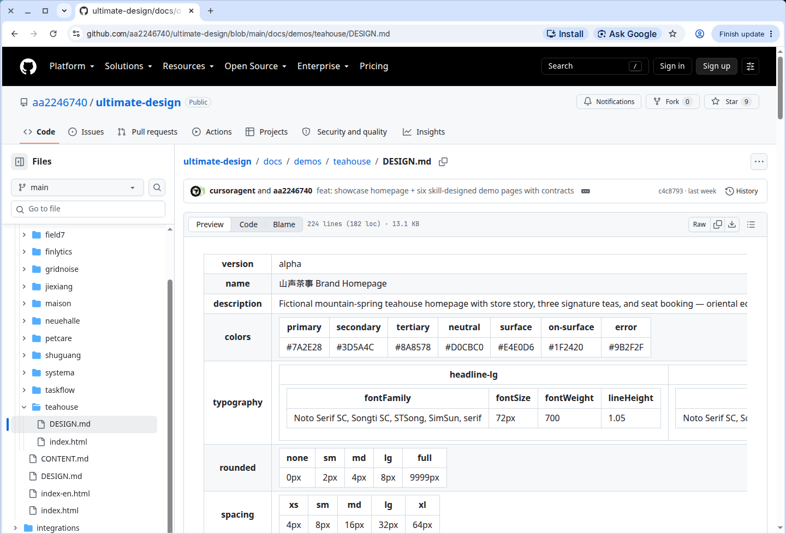
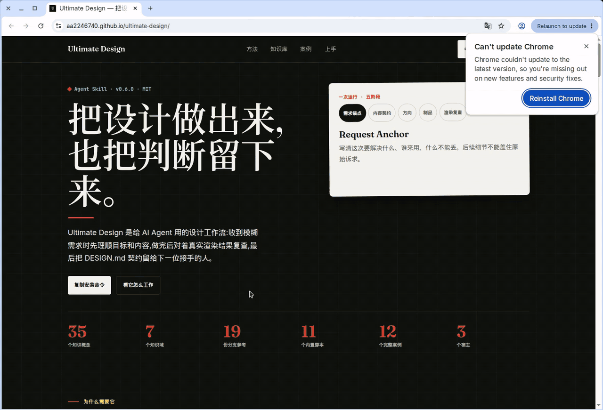

# Ultimate Design

[中文](README.md) · [English](README.en.md)

[](https://www.npmjs.com/package/ultimate-design-skill)
[](LICENSE)
[](https://bundledex.net)

**把设计做出来，也把判断留下来。**

给编码 Agent 用的 OKF 设计工作流：先钉住这次要解决什么，写出 `DESIGN.md` 契约，做成真实制品，对着浏览器渲染结果批判、修复、再交付。

## 先看成品

公开面是技能自己做出来的展示站：

**https://aa2246740.github.io/ultimate-design/**

十二个完整案例。每个案例都能打开对应的 `DESIGN.md`。



*https://aa2246740.github.io/ultimate-design/ — Chrome 打开的线上首页。顶栏写着 Ultimate Design，下面是标题、hero 和五阶段卡片。*



*同一站点滚到 `#gallery`。第一排是 Finlytics、山声茶事、TaskFlow 的真实卡片，不是另外做的站。*



*左：山声茶事成品页 `…/demos/teahouse/`。右：同案例的 `DESIGN.md`（画廊「看契约」打开的那份仓库文件）。GitHub Pages 上 `…/demos/teahouse/DESIGN.md` 是 404，所以契约看仓库，不看第二套站点。*



*同一份 `DESIGN.md` 的特写：`docs/demos/teahouse/DESIGN.md`，色板和字体写在成品旁边。*



*从官网首页点山声茶事的「查看页面」，落到 `…/demos/teahouse/`。同源：`aa2246740.github.io`。*

## 安装

```bash
npx ultimate-design-skill@latest --target codex
npx ultimate-design-skill@latest --target claude-code
npx ultimate-design-skill@latest --target pi-agent
```

项目内、共享目录、手动安装：见 [integrations/README.md](integrations/README.md)。

## 十二个案例

每个案例都是完整独立页。打开页面、复制当时的 Prompt、读它的契约——[十二个都在画廊里](https://aa2246740.github.io/ultimate-design/#gallery)。

| 案例 | 表面 | 设计语言 |
|---|---|---|
| [Finlytics](https://aa2246740.github.io/ultimate-design/demos/finlytics/) | SaaS 营销页 | 深色数据控制台 |
| [山声茶事](https://aa2246740.github.io/ultimate-design/demos/teahouse/) | 品牌官网 | 东方编辑纸感 |
| [TaskFlow](https://aa2246740.github.io/ultimate-design/demos/taskflow/) | 产品看板 | 安静日光系统界面 |
| [毛茸茸研究所](https://aa2246740.github.io/ultimate-design/demos/petcare/) | 预约落地页 | 奶油实验室、活泼 |
| [墨记 Q2 复盘](https://aa2246740.github.io/ultimate-design/demos/deck-q2/) | HTML 幻灯 | 矿物纸报告 |
| [GRID&NOISE](https://aa2246740.github.io/ultimate-design/demos/gridnoise/) | 工作室作品集 | 新粗野主义 |
| [SYSTEMA 2026](https://aa2246740.github.io/ultimate-design/demos/systema/) | 会议站 | 瑞士国际主义 |
| [Maison Ombre](https://aa2246740.github.io/ultimate-design/demos/maison/) | 电商产品页 | 静奢 |
| [FIELD-7](https://aa2246740.github.io/ultimate-design/demos/field7/) | 硬件产品页 | 工业功能主义 |
| [街巷](https://aa2246740.github.io/ultimate-design/demos/jiexiang/) | 独立刊物 | 新闻纸编辑 |
| [拾光书房](https://aa2246740.github.io/ultimate-design/demos/shuguang/) | 年度数据报告 | 数据叙事 |
| [新厅美术馆](https://aa2246740.github.io/ultimate-design/demos/neuehalle/) | 展览页 | 包豪斯几何 |

品牌都是虚构的。较新的风格来自技能的 Study 路线：从强参考里抽出可迁移的机制，不抄任何站点的签名。

## 一次运行留下什么

- **Request Anchor** — 这次要解决什么、给谁用、什么不能丢。
- **`DESIGN.md` 契约** — 色板、字体、方向、假设和待确认项，写给下一个 Agent 或人接着做，不用靠猜。
- **渲染复查** — 真实页面、截图、浏览器里量过的审计。

## 里面有什么

| 能力 | 内容 |
|---|---|
| **可操作的设计知识** | 35 个概念文件，7 个知识域：版式、字体、色彩、动效语言、内容模型、无障碍、治理。概念按需加载，只在它改掉一个具体决定时保持激活。 |
| **19 份分支参考** | 营销站、产品界面、演示 Deck、图形印刷、品牌系统、动效审计、参考研究、审计打磨等。 |
| **11 个随包校验与工具** | 契约校验、OKF 使用校验、固定版 Chromium **渲染界面审计**（溢出、裁切、遮挡、点击目标）、动效契约校验、Agent 交接检查。 |
| **4 条任务路线** | Build / Audit / Redesign / Study。Audit 和 Study 停在发现，不重做已经成立的东西。 |
| **多 Agent 可用** | Portable Specialist：Integrator 派工单，专家回包，一个写作者收口。模板随包。 |
| **12 个完整案例** | 十二页、十二种故意不同的设计语言，每个都由跑本技能的 Agent 做完，每个有自己的契约。 |

## 怎么用

说要的结果：

```text
用 $ultimate-design 把这份报告做成一张能看清的网页。需要的话先写 DESIGN.md，做出页面，批判，修好，再核对渲染结果。
```

关键选择想先对齐再动手，加上 `--pro`：

```text
$ultimate-design --pro
我要做一个给投资人看的产品站。先对齐受众、信息层级、品牌姿态和验收标准，再实现。
```

多域、高风险的工作，可以要求 **Portable Specialist 模式**：Integrator 在文件黑板上派 Narrative / Visual / Interaction 工单，自己当唯一终稿作者。细节：`skill/ultimate-design/references/multi-agent-mode.md`。

## 一次运行怎么走

1. **钉住需求** — 原始请求、最新覆盖、验收标准。
2. **理清内容** — 先排信息层级，再谈版式。
3. **只加载用得上的知识** — 每个激活的概念必须改掉一个真实决定。
4. **选定方向并做出来** — taste dials、反默认锁、语义区标记。
5. **批判、修复、核验** — 真实浏览器里做渲染界面审计，失败的修掉。
6. **留下治理** — 下一任能接着做的契约。

## 内置校验

视觉工作在交付前会渲染并复查。技能自带确定性工具：

```bash
npm run flow-check            # 技能流程完整性
npm run okf-graph-check       # 知识图一致性
npm run agent-handoff-check   # 多 Agent 交接 schema
npm run check-integrations    # 宿主集成健康
```

渲染界面审计（`validate_html_visual.mjs`）用固定版 Chromium 测量标过的语义区：横向溢出、裁切、遮挡、间距、可点目标尺寸。展示站和十二个案例都通过，零失败。

## License

[MIT](LICENSE)
